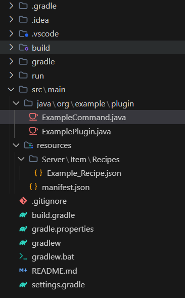
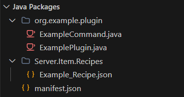

# SimpleJavaView

SimpleJavaView is a VS Code extension designed to streamline your Java development experience by providing a focused, uncluttered view of your source code. It simplifies the file explorer by isolating the `src/main/java` and `src/main/resources` directories and automatically flattening nested package structures.

## Java Packages View

The extension provides a dedicated "Java Packages" view that transforms deep directory structures into a clean, flat package view:

| Standard Explorer | Java Packages View |
| :---: | :---: |
|  |  |

## Features

- **Focused View**: A dedicated **Java Packages** view in the Explorer activity bar that shows only your essential Java source and resource.
- **Package Flattening**: Automatically compacts single-child directory paths (e.g., `com.example.project`) into a single tree node, similar to IntelliJ IDEA.
- **Live Updates**: The view automatically refreshes when files are added, changed, or deleted within your project.
- **Manual Refresh**: Includes a refresh button in the view title for quick manual synchronization.

## Usage

1. Open a Java project in VS Code.
2. Look for the **Java Packages** section in the Explorer sidebar.
3. Browse your source files in a flattened, clean tree structure.
4. Click the **Refresh** icon in the view header if you need to manually update the tree.

## Requirements

- VS Code version 1.104.0 or higher.
- A standard Java project structure (containing `src/main/java` and/or `src/main/resources`).

## Release Notes

### 0.0.1

- Initial release.
- Added "Java Src Only" explorer view.
- Implemented proactive directory compaction (package flattening).
- Added filesystem watcher for automatic updates.

---
**Enjoy a cleaner Java workspace!**
